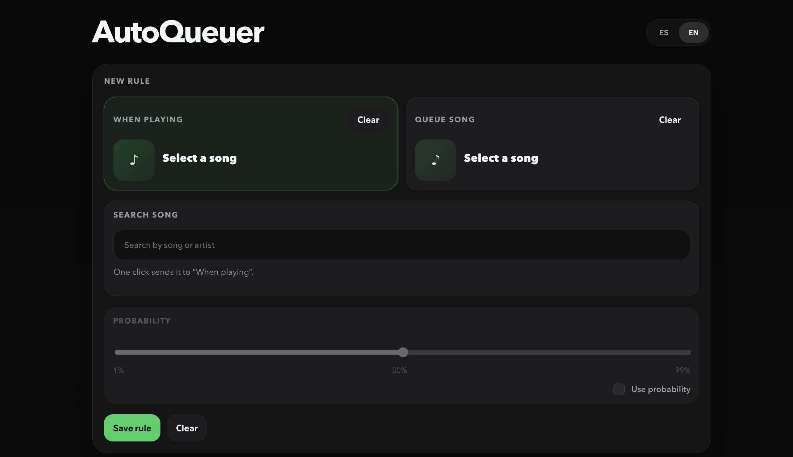
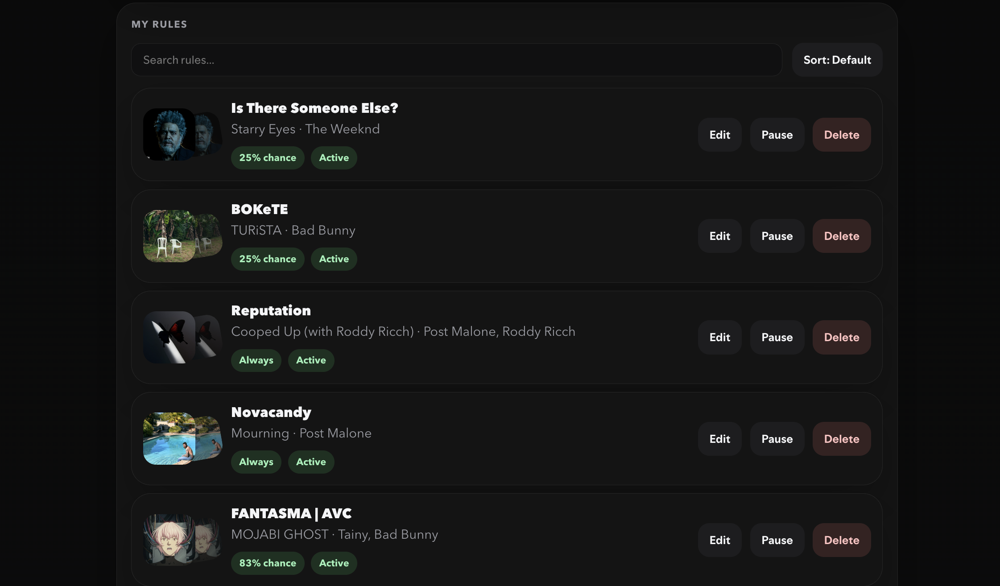
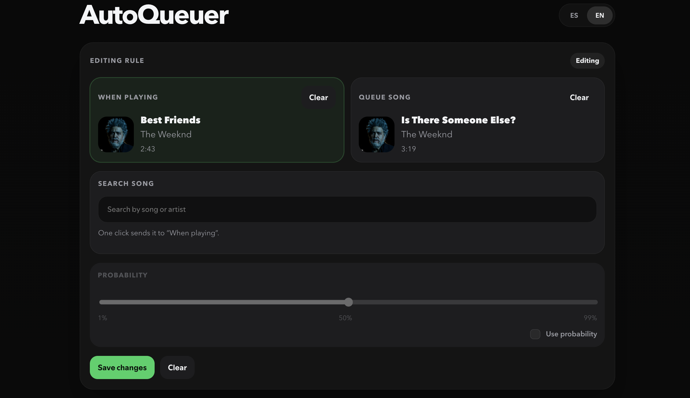

# AutoQueuer
**By AlemanGerman | [GitHub](https://github.com/AlemanGerman)**

**Language:** English | [Español](README.es.md)

> Automate your Spotify queue with custom rules that add one song after another.

**AutoQueuer** is a **Spicetify** app that removes the need to manually queue songs whenever you want one track to always be followed by another.

It's especially useful for albums or songs with seamless transitions, where playback order matters. It also supports configurable probabilities, allowing rules to trigger only some of the time for a more dynamic listening experience.

---

## Screenshots









## Why AutoQueuer?

Spotify lets you manually add songs to the queue, but it doesn't provide a way to automate that process.

With AutoQueuer, you can create rules like:

> **When playing:** Song A
> **Add to Queue:** Song B

Whenever Song A is played, Song B will automatically be added to the queue.

You can also decide whether the transition should always happen or only trigger based on a configurable probability.

---

## Features

* Automatically queues one song after another.
* Configurable probability from **1% to 99%**.
* Prevents duplicate queue entries if you restart or seek backward in a song.
* Queues the next song when the current one reaches approximately **70%** of its playback.
* Create, edit, pause, enable, disable, and delete rules.
* Fully integrated into Spotify through Spicetify.

---

## Installation

### Requirements

* Spicetify
* Spotify
* Internet connection to search for songs

### Windows

Open PowerShell and run the following command:

```powershell
Invoke-WebRequest -UseBasicParsing "[https://raw.githubusercontent.com/AlemanGerman/AutoQueuer/main/install.ps1](https://raw.githubusercontent.com/AlemanGerman/AutoQueuer/main/install.ps1)" | Invoke-Expression
```

### macOS / Linux

Run the following command:

```bash
curl -fsSL https://raw.githubusercontent.com/AlemanGerman/AutoQueuer/main/install.sh | sh
```

### Spicetify Marketplace

Hopefully, AutoQueuer will soon be available on the Spicetify Marketplace for one-click installation.

---

## Usage

1. Open Spotify.
2. Launch **AutoQueuer** from the top app bar.
3. Search for the song that will trigger the rule.
4. Select it under **When Playing**.
5. Search for the song you want to queue automatically.
6. Select it under **Add to Queue**.
7. Optionally configure a probability.
8. Save the rule.

From then on, AutoQueuer will automatically manage your queue whenever the rule conditions are met.

---

## How It Works

Each rule remains active until you disable it.

When a song reaches approximately **70%** of its playback, AutoQueuer checks:

* Whether a rule exists for the current song.
* Whether the rule is enabled.
* Whether the probability check (if configured) succeeds.
* Whether the destination song has already been queued during the current playback.

If all conditions are met, the destination song is automatically added to the queue.

---

## Current Limitations

* Only supports **one song → one song** rules.
* Local files are not currently supported.
* An internet connection is required to search for songs.
* Installation instructions are currently available only for macOS and Linux.

---

## Roadmap

* [ ] Rule execution history
* [ ] Probability history
* [ ] Visual probability indicator
* [ ] Probability reroll button
* [ ] Multiple destination songs per rule
* [ ] Additional automation options

---

## FAQ

### Do I need to configure anything after installing?

No. Just open AutoQueuer and start creating rules.

### Does it work with local files?

Not yet.

---

## Contributing

Bug reports, feature requests, and pull requests are always welcome.

If you have an idea to improve AutoQueuer or find a bug, feel free to open an Issue.

---

## Acknowledgements

* The **Spicetify** team for creating the framework that makes this project possible.
* Everyone who tests AutoQueuer and shares feedback.
* A special thanks to **Jordan**, my little Chihuahua, for keeping me company during countless hours of development.

---

## License

MIT License
